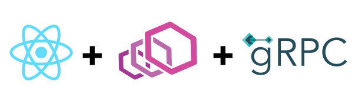

<div align="center">
  
</div>

# Microservices Architecture with gRPC and Envoy Proxy

This project showcases the implementation of client-server architecture with a communication model based on a reverse proxy by [Envoy Proxy](https://www.envoyproxy.io/), using gRPC for communication between services and the browser. The backend is built with Node.js and gRPC, while the frontend is developed using React.

## Installation

1. Clone the repository:

```bash
git clone https://github.com/HalasProject/grpc-client-server.git
cd grpc-envoy
```

2. Install the dependencies for the backend and frontend:
```bash
cd book_service
npm install

cd frontend
npm install
```

## Configuration

In the root of the project, you will find an `envoy.yaml` file. This file contains the configuration for the Envoy Proxy. Adjust the configuration based on your specific needs, such as ports, routes, and other settings.

## Generating Messages and Services

To generate the messages and services required for gRPC communication in browser (React), run the following command:

```bash
cd frontend
npm run generate:all
```

This command will use the Protobuf files defined in the proto directory to generate the necessary JavaScript files for the frontend with [grpc-web](https://github.com/grpc/grpc-web).

## Running the Application

To run the stack using [PM2](https://pm2.keymetrics.io/), follow these steps:

1. Ensure that PM2 is installed globally on your system:

```bash
npm install pm2 -g
```

2. Start the backend and frontend services also envoy using PM2:

```bash
pm2 start ecosystem.config.js
```

This command will read the configuration from the ecosystem.config.js file and start the backend and frontend services as separate processes also envoy proxy.


## Usage

With the application running, you can now interact with the microservices architecture using the browser interface. The frontend communicates with the backend services via gRPC and the Envoy Proxy.

Feel free to explore the functionality provided by the microservices architecture and customize it according to your requirements.

## Contributing

Contributions are welcome! If you would like to contribute to this project, please follow these steps:

1. Fork the repository.
2. reate a new branch for your feature or bug fix.
3. Make your changes and commit them.
4. Push your changes to your forked repository.
5. Submit a pull request to the original repository.

Please ensure your code follows the project's coding conventions and includes appropriate tests.

## License

This project is licensed under the [MIT License](LICENSE).